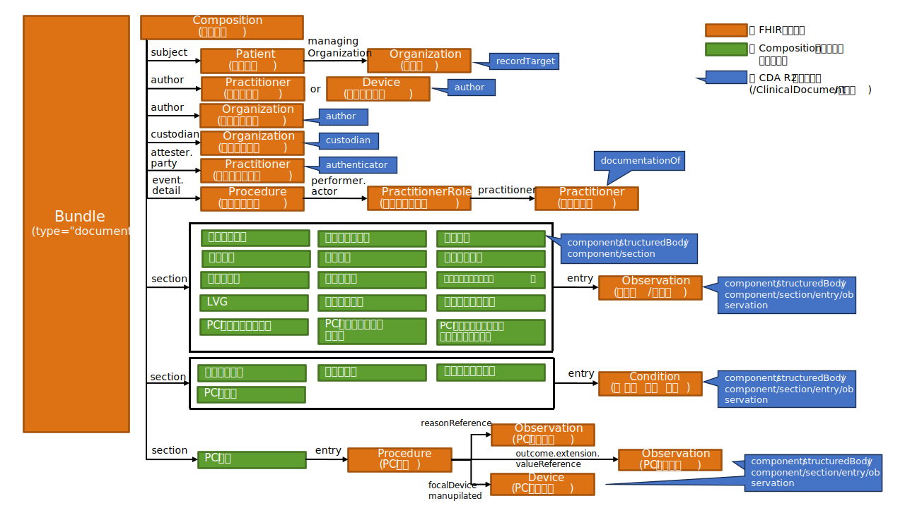

### 心臓カテーテル検査レポート用FHIRドキュメントの全体構造
#### 全体構造
本実装ガイドでは、SS-MIX2拡張ストレージにSEAMATに準拠したフォルダ構成で保存されたHL7 CDA形式の心臓カテーテル検査レポートをレポートごとに「FHIRドキュメント」という形式のFHIRリソースに変換して記述する。
FHIRドキュメントは、複数のFHIRリソースをまとめるためのBundleリソースのtype要素の値を”document”としたもので、先頭に内包しているCompositionリソースで文書のセクション構造と叙述的なテキストコンテンツを記述し、その後に内包しているPatient, Organization, Practitioner, Observation等のリソースでセクションに紐づけられた形で構造化されたコンテンツを記述することができる。
([http://hl7.org/fhir/documents.html](http://hl7.org/fhir/documents.html))

以降の章では、心臓カテーテル検査レポートを構成するFHIRリソースの記述仕様（CDA文書の対応する要素を含む）を、次の項目に従って共通の表形式で記述する。

[＜FHIRリソースの記述仕様の凡例＞](tables.html#リソース記述仕様の凡例)

#### 心臓カテーテル検査レポート用FHIRドキュメントのトピック

##### 各リソースのプロファイルのURLの命名規則を下記とする
本実装ガイドでは、下記のような命名規則により各リソースのプロファイルURLを生成することとする。

    http://jpfhir.jp/fhir/SEAMAT/StructureDefinition/JP_<リソース名>_SEAMAT_<用途>（SEAMAT共通）
  
    http://jpfhir.jp/fhir/SEAMAT/StructureDefinition/JP_<リソース名>_CATHReport（心臓カテーテル検査固有）

    http://jpfhir.jp/fhir/SEAMAT/StructureDefinition/JP_<リソース名>_PCI（PCI検査固有）

##### Bundle.identifierにSS-MIX2拡張ストレージのコンテンツフォルダ名を持たせる
SS-MIX2では、拡張ストレージのコンテンツフォルダ名は、以下のような書式で記載することが求められている。

  「<患者ID>_<診療日>_<データ種別>_<特定キー>_<発生日時>_<診療科コード>_<コンディションフラグ>」

SEAMATでは、これらの要素に、以下のような項目を組み合わせて指定することが決められている。

 - <患者ID> : 心電図検査レポートの対象患者の該当医療機関におけるID
 - <診療日> : 心電図検査レポートの対象となった心電図検査の検査日（<検査日>）
 - <データ種別> : 心電図検査レポートのデータ種別情報を「<データ種別コード><レポート/データフラグ>」形式で指定する。（例：LJCS-100D）
   - <データ種別コード> : 診療情報を大きく分類するためのコード
   - <レポート/データフラグ> : 検査レポート、検査データを区別するためのフラグ
 - <特定キー> : 心電図検査レポートの対象検査の各種ID情報を「<ファイル作成日時>.<データ管理番号>.<オーダ番号>.<部門管理番号>」形式で指定する。
   - <ファイル作成日時> : 検査レポートの場合は検査レポート作成日時。検査データの場合はモダリティでの測定日時相当の日時
   - <データ管理番号> : データやレポートを識別する同一部門管理番号内でユニークな値
   - <オーダ番号> : 電子カルテが発番する、施設内でユニークなオーダ単位の値
   - <部門管理番号> : 検査部門が発番する検査毎にユニークな値

本実装ガイドでは、Bundle.identifier要素に上記のコンテンツフォルダ名を持たせるとともに、その構成要素である<検査日><データ種別コード><レポート/データフラグ><ファイル作成日時><データ管理番号><オーダ番号><部門管理番号>の計7項目をSEAMATのキー情報と呼んで、次節で述べるように個別にマッピングする。

##### SS-MIX2拡張ストレージのコンテンツフォルダ名からSEAMATのキー情報を抽出して、Procedureリソースに個別にマッピングする
本実装ガイドでは、SEAMATのキー情報のうち、<検査日><データ種別コード><レポート/データフラグ><データ管理番号><オーダ番号><部門管理番号>の6項目をProcedureリソースを使用して個別にマッピングする。マッピング先の要素は以下の通り。
  - <検査日> : performedDateTime要素
  - <データ種別コード><レポート/データフラグ> : category要素
  - <データ管理番号> : identifier要素
  - <オーダ番号> : identifier要素
  - <部門管理番号> : identifier要素

##### PCI処置の情報をProcedureリソースに個別にマッピングする
本実装ガイドでは、PCI検査の場合のみPCI処置セクションで記述されているPCI処置の情報をProcedureリソースを使用して個別にマッピングする。マッピング先の要素は以下の通り。
  - <実施有無> : status要素
  - <Stenosis_Pre>,<TimiGrade_Pre>、<病変正常>、<病変分類> : reasonReference要素（Observationリソースを参照）
  - <部位> : bodySite要素
  - <実施成否> : outcome要素
  - <Stenosis_Post>,<TimiGrade_Post > : outcome要素下のJP_Procedure_PCIOutcomeDetail拡張（Observationリソースを参照）
  - <使用機器> : focalDevice.manipulated要素（Device要素を参照）

### FHIRドキュメントのリソースの構成
心臓カテーテル検査レポート用のFHIRドキュメントでは、以下のようなリソースの構成を想定している。

| エントリ(entry)で表現する情報 | 使用されるFHIRリソース         | リソースの多重度 |
|--------------------|-----------------------|----------|
| 文書構成情報エントリ         | Compositionリソース       | 1..1     |
| 患者情報エントリ           | Patientリソース           | 1..1     |
| 所属科エントリ            | Organizationリソース      | 0..1     |
| 作成者エントリ            | Practitionerリソース      | 0..1     |
| 作成システムエントリ         | Deviceリソース            | 0..1     |
| 作成医療機関エントリ         | Organizationリソース      | 0..1     |
| 管理医療機関エントリ         | Organizationリソース      | 1..1     |
| 文書内容責任者エントリ        | Practitionerリソース      | 0..1     |
| 検査実施情報エントリ         | Procedureリソース         | 1..1     |
| 検査実施者役割エントリ        | PractitionerRoleリソース  | 0..1     |
| 検査実施者エントリ          | Practitionerリソース      | 0..1     |
| 測定者エントリ            | Practitionerリソース      | 0..*     |
| 測定システムエントリ         | Deviceリソース            | 0..*     |
| 測定結果/解析結果エントリ      | Observationリソース       | 0..*     |
| 外部参照ドキュメントエントリ     | DocumentReferenceリソース | 0..*     |
| 外部参照データエントリ        | Binaryリソース            | 0..*     |
| PCI処置エントリ          | Procedureリソース         | 0..*     |
| 心カテ傷病名エントリ         | Conditionリソース         | 0..*     |
| PCI使用機器エントリ        | Deviceリソース            | 0..*     |

心臓カテーテル検査レポート用FHIRドキュメントのBundleリソースの仕様を次の表に示す。

[＜表19 Bundleリソースの仕様（心臓カテーテル検査レポート）＞](tables-ccs.html#表19-bundleリソースの仕様（心臓カテーテル検査レポート）)

心臓カテーテル検査レポート用FHIRドキュメントの全体像を下図に示す。

 

type要素が"document"のBundleリソースの中にCompositionをはじめとする各種リソースが内包されており、Compositionリソースのsubject, author, custodian などの固定要素や、各セクションのsection.entry要素などから、構造化されたリソースが各Bundle.entry.fullUrlに記述されたUUIDの値を使用して内部参照されている。PractitionerRoleなど一部のリソースは構造化されたリソースから参照され、Compositionリソースからは直接参照されていない。

### Compositionリソース
Compositionリソースは、心臓カテーテル検査レポート用FHIRドキュメントにentryとして格納される複数のリソースのうちの最初に出現するもので、この文書のセクションの構成や叙述的なテキストコンテンツを記述したものである。 心臓カテーテル検査レポート用FHIRドキュメントでのCompositionリソースの仕様を次の表に示す。

[＜表20 Compositionリソースの仕様（心臓カテーテル検査レポート）＞](tables.html#表20-compositionリソースの仕様（心臓カテーテル検査レポート）)

心臓カテーテル検査レポートは、あとで説明するように19種類のセクションから構成されている。 Compositionリソースは患者や作成者など文書情報管理用の情報を記述するいわゆるヘッダ部、およびレポートの本体内容を記述するボディ部から構成される。 ヘッダ部はCompositionリソースの要素により記述され、ボディ部の情報は複数のセクションから構成される。 なお、ヘッダ部、ボディ部という表現は、ここで心臓カテーテル検査レポート構造化記述規約（本仕様書ではCDA規約と略すこともある）との対比をわかりやすくするために便宜上用いているが、Compositionリソース内で明示的に区別されるわけではない。

**文書管理情報（ヘッダ部）**

|No. | 情報名称  | Composition リソースの要素 | 必須/任意 | 参照先のFHIR リソース種別 |
|----|----------|----------------------------|----------|------------------------|
| 1	 | 患者情報  | subject | 必須 |	Patient |
| 2  | 作成・編集日時 |	date |	必須 | ― |
| 3	 | 文書作成責任者/文書作成システム |	author |	必須 | Practitioner/Device |
| 4	 | 文書作成機関	| author |	任意 |	Organization |
| 5	 | 文書内容責任者 | attester(.mode=official) | 任意 |Practitioner |
| 6	 | 文書管理責任機関 | custodian | 必須 | Organization |
| 7  | 検査実施情報 | event |	必須 | Procedure |

**心臓カテーテル検査レポート本体（ボディ部）でのセクション構成**

| セクション コード | セクション名                | 必須/任意 | section.entry 参照先のFHIR リソース種別 | section. entryの 多重度 |
|---------------|-----------------------|-------|---------------------------------------|-----------------------------|
| 52460-3       | 患者付帯情報                | 任意    | Observation                           | 1..1                        |
| 78923-0       | 併存疾患情報                | 任意    | Condition                             | 1..1                        |
| 78940-4       | 冠危険因子                 | 任意    | Condition                             | 1..1                        |
| 78941-2       | 循環器疾患既往歴              | 任意    | Condition                             | 1..1                        |
| 80286-8       | 過去の血行再建               | 任意    | Observation                           | 1..1                        |
| 80528-3       | 術前情報                  | 任意    | Observation                           | 1..1                        |
| 80190-2       | 検査情報                  | 任意    | Observation                           | 1..1                        |
| 78949-5       | 検査内容                  | 任意    | Observation                           | 1..1                        |
| 78933-9       | 補助循環治療                | 任意    | Observation                           | 1..1                        |
| 78942-0       | カテーテル                 | 任意    | Observation                           | 1..1                        |
| 78895-0       | 冠動脈病変                 | 任意    | Observation                           | 1..1                        |
| 80192-8       | 冠動脈病変［拡張項目］           | 任意    | Observation                           | 1..1                        |
| 78950-3       | LVG                   | 任意    | Observation                           | 1..1                        |
| 8357-6        | 心内圧データ                | 任意    | Observation                           | 1..1                        |
| 80191-0       | スパズム負荷試験              | 任意    | Observation                           | 1..1                        |
| 78943-8       | PCI合併症                | 任意    | Condition                             | 1..1                        |
| 78914-9       | PCI処置                 | 任意    | Procedure                             | 1..1                        |
| 80527-5       | PCI処置［拡張項目］           | 任意    | Observation                           | 1..1                        |
| 80731-3       | PCI処置詳細［拡張項目］         | 任意    | Observation                           | 1..1                        |
| 78939-6       | PCI処置詳細ステント基本情報［拡張項目］ | 任意    | Observation                           | 1..1                        |

### Compositionリソースから各リソースへの参照
以下では、内部の各FHIRリソースインスタンスを参照するCompositionの要素について概説する。

#### Composition.subject要素
この心臓カテーテル検査レポートを作成する対象となる患者のPatientリソースを、そのPatientリソースのリソースIDである”urn:uuid:…..”　を記述することにより内部参照する。 必須要素である。 Patientリソースの仕様は次の表で示す。

[＜表3 Patientリソースの仕様＞](tables.html#表3-patientリソースの仕様)

また、対象患者の所属診療科のOrganizationリソースを、Patient.managingOrganization要素でそのOrganizationリソースのリソースIDである”urn:uuid:…..”　を記述することにより内部参照する。 任意要素である。 Organizationリソースの仕様は次の表で示す。

[＜表4 所属科Organizationリソースの仕様＞](tables.html#表4-所属科organizationリソースの仕様)

#### Composition.author要素
この心臓カテーテル検査レポートの作成責任者を表すPractionerリソースないし作成システムを表すDeviceリソースを、そのPractionerリソースないしDeviceリソースのリソースIDである”urn:uuid:…..”　を記述することにより内部参照する。 さらに同じ要素に、続けて文書作成機関を表すOrganizationリソースを、そのOrganizationリソースのリソースIDである”urn:uuid:…..”　を記述することにより内部参照する。

作成責任者（Practitionerリソース）ないし作成システム（Deviceリソース）のいずれかは必須である。文書作成医療機関情報（Organizationリソース）は任意である。

Practionerリソース、Deviceリソース、Organizationリソースの仕様をそれぞれ次の表で示す。

[＜表5 作成責任者Practitionerリソースの仕様＞](tables.html#表5-作成責任者practitionerリソースの仕様)
[＜表6 作成システムDeviceリソースの仕様＞](tables.html#表6-作成システムdeviceリソースの仕様)
[＜表7 作成医療機関Organizationリソースの仕様＞](tables.html#表7-作成医療機関organizationリソースの仕様)

#### Composition.custodian要素
この心臓カテーテル検査レポートの作成・修正を行い、文書の管理責任を持つ機関を表す。

文書作成機関とは別のOrganizationリソースで記述し、custodian要素からはそのOrganizationリソースのリソースIDである “urn:uuid: …” 　を記述することにより内部参照する。 必須要素である。

管理医療機関のOrganizationリソースの仕様を次の表で示す。

[＜表8 管理医療機関Organizationリソースの仕様＞](tables.html#表8-管理医療機関organizationリソースの仕様)

#### Composition.attester要素
この心臓カテーテル検査レポートの内容に関する責任を持つ職員の情報をPractitionerリソースで記述し、attester.party要素からはそのPractitionerリソースのリソースIDである “urn:uuid: …” 　を記述することにより内部参照する。また、attester.mode要素には「公的責任」を表す "official"を固定で設定し、attester.timeには文書内容を承認した日時を設定する。 これらはすべて任意要素である。

文書内容責任者のPractitionerリソースの仕様を次の表で示す。

[＜表9 文書内容責任者Practitionerリソースの仕様＞](tables.html#表9-文書内容責任者practitionerリソースの仕様)

#### Composition.event要素
この心臓カテーテル検査レポートの元となった当該医療機関での心臓カテーテル検査の実施日時を Composition.event.period で示すとともに、実施情報をProcedureリソースで記述し、event.detail要素からはProcedureリソースのリソースIDである “urn:uuid: …” 　を記述することにより内部参照する。 必須要素である。

また、Procedureリソースのperformer.actor要素からは、検査実施者の役割を記述したPractitionerRoleリソース、更にPractitionerRoleリソースのpractitioner要素からは検査実施者の情報を記述したPractitionerリソースをリソースIDである “urn:uuid: …” 　を記述することにより内部参照する。これらは任意要素である。

検査実施情報のProcedureリソース、検査実施者役割のPractitionerRoleリソース、検査実施者のPractitionerリソースの仕様を、それぞれ次の表で示す。

[＜表10 検査実施情報Procedureリソースの仕様＞](tables.html#表10-検査実施情報procedureリソースの仕様)
[＜表11 検査実施者役割PractitionerRoleリソースの仕様＞](tables.html#表11-検査実施者役割practitionerroleリソースの仕様)
[＜表12 検査実施者Practitionerリソースの仕様＞](tables.html#表12-検査実施者practitionerリソースの仕様)

#### Composition.section要素
Compositionリソースのsection要素は文書の章、節、項などのセクション構造を表現するためのもので、FHIR基底仕様では階層的に配置することが可能であるが、心臓カテーテル検査レポート用のFHIRドキュメントでは、すべてCompositionの直下に配置し、セクションのネストは行わない。
Composition.section共通の仕様を次の表で示す。

[＜表13 Compositionリソースのsectionの仕様＞](tables.html#表13-compositionリソースのsectionの仕様)

section.code要素でセクションの識別を行い、section.title要素でそのタイトルを、section.text要素で叙述的なテキストコンテンツをXHTML形式で記述できる。

また、セクションによっては構造化された情報を複数のObservation, Conditionなどのリソースで記述し、section.entry要素から内部参照できる。これらは任意要素である。

以下では、各セクションの使い方について説明する。

#### 患者付帯情報セクション
対象患者の検査時の年齢をObservationリソースを使用して記述し、section.entry要素からはをそのリソースをリソースIDである “urn:uuid: …” を記述することにより内部参照する。
 セクションコード：52460-3
 このセクションは任意である。

Observationリソースの仕様を次の表で示す。

[＜表16 測定値／解析結果Observationリソースの仕様＞](tables.html#表16-測定値解析結果observationリソースの仕様)

#### 併存疾患情報セクション
心血管イベントに影響のある併存疾患についての記述をConditionリソースを使用して記述し、section.entry要素からはをそのリソースをリソースIDである “urn:uuid: …” を記述することにより内部参照する。
 セクションコード：78923-0
 このセクションは任意である。

Conditionリソースの仕様を次の表で示す。

[＜表22 Conditionリソースの仕様（心臓カテーテル検査疾患情報）＞](tables.html#表22-conditionリソースの仕様（心臓カテーテル検査疾患情報）)

#### 冠危険因子セクション
冠動脈に関する危険因子をConditionリソースを使用して記述し、section.entry要素からはをそのリソースをリソースIDである “urn:uuid: …” を記述することにより内部参照する。
 セクションコード：78940-4
 このセクションは任意である。

Conditionリソースの仕様を次の表で示す。

[＜表22 Conditionリソースの仕様（心臓カテーテル検査疾患情報）＞](tables.html#表22-conditionリソースの仕様（心臓カテーテル検査疾患情報）)（再掲）

#### 循環器疾患既往歴セクション
過去の病歴、プロブレム、診断の経歴をConditionリソースを使用して記述し、section.entry要素からはをそのリソースをリソースIDである “urn:uuid: …” を記述することにより内部参照する。
 セクションコード：78941-2
 このセクションは任意である。

Conditionリソースの仕様を次の表で示す。

[＜表22 Conditionリソースの仕様（心臓カテーテル検査疾患情報）＞](tables.html#表22-conditionリソースの仕様（心臓カテーテル検査疾患情報）)（再掲）

#### 過去の血行再建セクション
患者の医療リスクに影響を与える可能性に関する患者の遺伝関係のある親族の情報をObservationリソースを使用して記述し、section.entry要素からはをそのリソースをリソースIDである “urn:uuid: …” を記述することにより内部参照する。
 セクションコード：80286-8
 このセクションは任意である。

Observationリソースの仕様を次の表で示す。

[＜表16 測定値／解析結果Observationリソースの仕様＞](tables.html#表16-測定値解析結果observationリソースの仕様)（再掲）

#### 術前情報セクション
24時間以内の患者の心疾患情報をObservationリソースを使用して記述し、section.entry要素からはをそのリソースをリソースIDである “urn:uuid: …” を記述することにより内部参照する。
 セクションコード：80528-3
 このセクションは任意である。

Observationリソースの仕様を次の表で示す。

[＜表16 測定値／解析結果Observationリソースの仕様＞](tables.html#表16-測定値解析結果observationリソースの仕様)（再掲）

#### 検査情報セクション
検査に関する情報をObservationリソースを使用して記述し、section.entry要素からはをそのリソースをリソースIDである “urn:uuid: …” を記述することにより内部参照する。
 セクションコード：80190-2
 このセクションは任意である。

Observationリソースの仕様を次の表で示す。

[＜表16 測定値／解析結果Observationリソースの仕様＞](tables.html#表16-測定値解析結果observationリソースの仕様)（再掲）

#### 検査内容セクション
検査内容に関する情報をObservationリソースを使用して記述し、section.entry要素からはをそのリソースをリソースIDである “urn:uuid: …” を記述することにより内部参照する。
 セクションコード：78949-5
 このセクションは任意である。

Observationリソースの仕様を次の表で示す。

[＜表16 測定値／解析結果Observationリソースの仕様＞](tables.html#表16-測定値解析結果observationリソースの仕様)（再掲）

#### 補助循環治療セクション
補助循環を用いた治療の有無に関する情報をObservationリソースを使用して記述し、section.entry要素からはをそのリソースをリソースIDである “urn:uuid: …” を記述することにより内部参照する。
 セクションコード：78933-9
 このセクションは任意である。

Observationリソースの仕様を次の表で示す。

[＜表16 測定値／解析結果Observationリソースの仕様＞](tables.html#表16-測定値解析結果observationリソースの仕様)（再掲）

#### カテーテルセクション
使用されたカテーテルに関する情報をObservationリソースを使用して記述し、section.entry要素からはをそのリソースをリソースIDである “urn:uuid: …” を記述することにより内部参照する。
 セクションコード：78942-0
 このセクションは任意である。

Observationリソースの仕様を次の表で示す。

[＜表16 測定値／解析結果Observationリソースの仕様＞](tables.html#表16-測定値解析結果observationリソースの仕様)（再掲）

#### 冠動脈病変セクション
冠動脈の病変に関する情報をObservationリソースを使用して記述し、section.entry要素からはをそのリソースをリソースIDである “urn:uuid: …” を記述することにより内部参照する。
 セクションコード：78895-0
 このセクションは任意である。

Observationリソースの仕様を次の表で示す。

[＜表16 測定値／解析結果Observationリソースの仕様＞](tables.html#表16-測定値解析結果observationリソースの仕様)（再掲）

#### 冠動脈病変［拡張項目］セクション
心カテ情報システムの拡張項目の冠動脈の病変に関する情報をObservationリソースを使用して記述し、section.entry要素からはをそのリソースをリソースIDである “urn:uuid: …” を記述することにより内部参照する。
 セクションコード：80192-8
 このセクションは任意である。

Observationリソースの仕様を次の表で示す。

[＜表16 測定値／解析結果Observationリソースの仕様＞](tables.html#表16-測定値解析結果observationリソースの仕様)（再掲）

#### LVGセクション
LVG（左室造影検査）に関する情報をObservationリソースを使用して記述し、section.entry要素からはをそのリソースをリソースIDである “urn:uuid: …” を記述することにより内部参照する。
 セクションコード：78950-3
 このセクションは任意である。

Observationリソースの仕様を次の表で示す。

[＜表16 測定値／解析結果Observationリソースの仕様＞](tables.html#表16-測定値解析結果observationリソースの仕様)（再掲）

#### 心内圧データセクション
心内圧に関する情報をObservationリソースを使用して記述し、section.entry要素からはをそのリソースをリソースIDである “urn:uuid: …” を記述することにより内部参照する。
 セクションコード：8357-6
 このセクションは任意である。

Observationリソースの仕様を次の表で示す。

[＜表16 測定値／解析結果Observationリソースの仕様＞](tables.html#表16-測定値解析結果observationリソースの仕様)（再掲）

#### スパズム負荷試験セクション
スパズム負荷試験に関する情報をObservationリソースを使用して記述し、section.entry要素からはをそのリソースをリソースIDである “urn:uuid: …” を記述することにより内部参照する。
 セクションコード：80191-0
 このセクションは任意である。

Observationリソースの仕様を次の表で示す。

[＜表16 測定値／解析結果Observationリソースの仕様＞](tables.html#表16-測定値解析結果observationリソースの仕様)（再掲）

#### PCI合併症セクション
PCI時に発生した合併症に関する情報をConditionリソースを使用して記述し、section.entry要素からはをそのリソースをリソースIDである “urn:uuid: …” を記述することにより内部参照する。
 セクションコード：78943-8
 このセクションは任意である。

Conditionリソースの仕様を次の表で示す。

[＜表22 Conditionリソースの仕様（心臓カテーテル検査疾患情報）＞](tables.html#表22-conditionリソースの仕様（心臓カテーテル検査疾患情報）)（再掲）

#### PCI処置セクション
PCIで行った処置に関する情報をProcedureリソースを使用して記述し、section.entry要素からはをそのリソースをリソースIDである “urn:uuid: …” を記述することにより内部参照する。
 セクションコード：78914-9
 このセクションは任意であり、処置を行った部位の数だけ繰り返す。

CDAで構造化されて記述されている各項目ごとの、Procedureリソースのマッピング先の要素は以下の通り。
  - <実施有無> : status要素
  - <Stenosis_Pre>,<TimiGrade_Pre>、<病変正常>、<病変分類> : reasonReference要素（Observationリソースを参照）
  - <部位> : bodySite要素
  - <実施成否> : outcome要素
  - <Stenosis_Post>,<TimiGrade_Post > : outcome要素下のJP_Procedure_PCIOutcomeDetail拡張（Observationリソースを参照）
  - <使用機器> : focalDevice.manipulated要素（Device要素を参照）

Procedureリソースの仕様を次の表で示す。

[＜表21 Procedureリソースの仕様（PCI処置情報）＞](tables.html#表21-procedureリソースの仕様（PCI処置情報）)

Procedureリソースから参照されているObservationリソース、Deviceリソースの仕様を次の表で示す。

[＜表16 測定値／解析結果Observationリソースの仕様＞](tables.html#表16-測定値解析結果observationリソースの仕様)（再掲）
[＜表23 PCI使用機器Deviceリソースの仕様＞](tables.html#表23-pci使用機器deviceリソースの仕様)

outcome要素下に対して定義されているJP_Procedure_PCIOutcomeDetail拡張の仕様を次の表で示す。

[＜表24 JP_Procedure_PCIOutcomeDetail拡張の仕様＞](tables.html#表24-jp_procedure_pcioutcomedetail拡張の仕様)

#### PCI処置［拡張項目］セクション
心カテ情報システムの、PCIで行った処置に関する拡張項目情報をObservationリソースを使用して記述し、section.entry要素からはをそのリソースをリソースIDである “urn:uuid: …” を記述することにより内部参照する。
 セクションコード：80527-5
 このセクションは任意であり、処置を行った部位の数だけ繰り返す。

Observationリソースの仕様を次の表で示す。

[＜表16 測定値／解析結果Observationリソースの仕様＞](tables.html#表16-測定値解析結果observationリソースの仕様)（再掲）

#### PCI処置詳細［拡張項目］セクション
心カテ情報システムの、PCIで行った処置の結果に関する拡張項目情報をObservationリソースを使用して記述し、section.entry要素からはをそのリソースをリソースIDである “urn:uuid: …” を記述することにより内部参照する。
 セクションコード：80731-3
 このセクションは任意であり、病変を持つ冠動脈のセグメントの数だけ繰り返す。

Observationリソースの仕様を次の表で示す。

[＜表16 測定値／解析結果Observationリソースの仕様＞](tables.html#表16-測定値解析結果observationリソースの仕様)（再掲）

#### PCI処置詳細ステント基本情報［拡張項目］セクション
心カテ情報システムの、PCIで使用したステントに関する拡張項目情報をObservationリソースを使用して記述し、section.entry要素からはをそのリソースをリソースIDである “urn:uuid: …” を記述することにより内部参照する。
 セクションコード：78939-6
 このセクションは任意であり、ステント通番の数だけ繰り返す。

Observationリソースの仕様を次の表で示す。

[＜表16 測定値／解析結果Observationリソースの仕様＞](tables.html#表16-測定値解析結果observationリソースの仕様)（再掲）

### 名前空間、コードシステム、バリューセットと識別子
本実装ガイドで定義された名前空間、コードシステム、バリューセットとその識別子の一覧を次の表で示す。

[＜表19 名前空間一覧＞](namespace.html)


