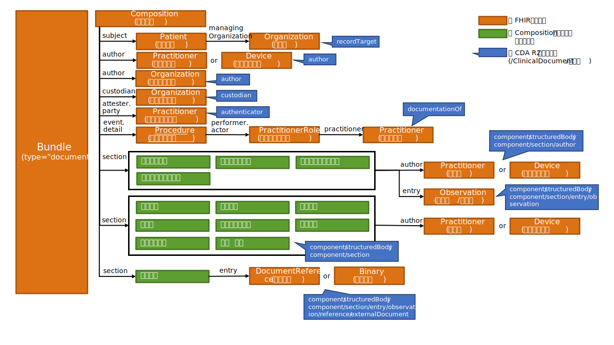

### 心電図検査レポート用FHIRドキュメントの全体構造
#### 全体構造
本実装ガイドでは、SS-MIX2拡張ストレージにSEAMATに準拠したフォルダ構成で保存されたHL7 CDA形式の心電図検査レポートをレポートごとに「FHIRドキュメント」という形式のFHIRリソースに変換して記述する。
FHIRドキュメントは、複数のFHIRリソースをまとめるためのBundleリソースのtype要素の値を”document”としたもので、先頭に内包しているCompositionリソースで文書のセクション構造と叙述的なテキストコンテンツを記述し、その後に内包しているPatient, Organization, Practitioner, Observation等のリソースでセクションに紐づけられた形で構造化されたコンテンツを記述することができる。
([http://hl7.org/fhir/documents.html](http://hl7.org/fhir/documents.html))

以降の章では、心電図検査レポートを構成するFHIRリソースの記述仕様（CDA文書の対応する要素を含む）を、次の項目に従って共通の表形式で記述する。

[＜FHIRリソースの記述仕様の凡例＞](tables.html#リソース記述仕様の凡例)

#### 心電図検査レポート用FHIRドキュメントのトピック

##### 各リソースのプロファイルのURLの命名規則を下記とする
本実装ガイドでは、下記のような命名規則により各リソースのプロファイルURLを生成することとする。

    http://jpfhir.jp/fhir/SEAMAT/StructureDefinition/JP_<リソース名>_SEAMAT_<用途>（SEAMAT共通）
  
    http://jpfhir.jp/fhir/SEAMAT/StructureDefinition/JP_<リソース名>_EKGReport（心電図固有）

##### 外部参照の画像データや波形データ、PDFデータはDocumentReferenceリソースやBinaryリソースに内包化する
SEAMATでは画像データや波形データ、PDFデータ等は別ファイルに保存してCDA文書から外部参照されているが、本実装ガイドでは、それらのデータをFHIRリソースとして利用できるよう、DocumentReferenceリソースやBinaryリソースの内部にデータを持つ形式とする。

### FHIRドキュメントのリソースの構成
心電図検査レポート用のFHIRドキュメントでは、以下のようなリソースの構成を想定している。

| エントリ(entry)で表現する情報  | 使用されるFHIRリソース | リソースの多重度 |
|-------------------------------|----------------------|----------------|
| 文書構成情報エントリ | Compositionリソース | 1..1 |
| 患者情報エントリ | Patientリソース | 1..1 |
| 所属科エントリ | Organizationリソース | 0..1 |
| 作成者エントリ | Practitionerリソース | 0..1 |
| 作成システムエントリ | Deviceリソース | 0..1 |
| 作成医療機関エントリ | Organizationリソース | 0..1 |
| 管理医療機関エントリ | Organizationリソース | 1..1 |
| 文書内容責任者エントリ | Practitionerリソース | 0..1 |
| 検査実施情報エントリ | Procedureリソース | 1..1 |
| 検査実施者役割エントリ | PractitionerRoleリソース | 0..1 |
| 検査実施者エントリ | Practitionerリソース | 0..1 |
| 測定者エントリ | Practitionerリソース | 0..* |
| 測定システムエントリ | Deviceリソース | 0..* |
| 測定結果/解析結果エントリ | Observationリソース | 0..* |
| 外部参照ドキュメントエントリ | DocumentReferenceリソース | 0..* |
| 外部参照データエントリ | Binaryリソース | 0..* |

心電図検査レポート用FHIRドキュメントのBundleリソースの仕様を次の表に示す。

[＜表1 Bundleリソースの仕様＞](tables.html#表1-bundleリソースの仕様)

心電図検査レポート用FHIRドキュメントの全体像を下図に示す。

 

type要素が"document"のBundleリソースの中にCompositionをはじめとする各種リソースが内包されており、Compositionリソースのsubject, author, custodian などの固定要素や、各セクションのsection.entry要素などから、構造化されたリソースが各Bundle.entry.fullUrlに記述されたUUIDの値を使用して内部参照されている。PractitionerRoleなど一部のリソースは構造化されたリソースから参照され、Compositionリソースからは直接参照されていない。

### Compositionリソース
Compositionリソースは、心電図検査レポート用FHIRドキュメントにentryとして格納される複数のリソースのうちの最初に出現するもので、この文書のセクションの構成や叙述的なテキストコンテンツを記述したものである。 心電図検査レポート用FHIRドキュメントでのCompositionリソースの仕様を次の表に示す。

[＜表2 Compositionリソースの仕様＞](tables.html#表2-compositionリソースの仕様)

心電図検査レポートは、あとで説明するように13種類のセクションから構成されている。 Compositionリソースは患者や作成者など文書情報管理用の情報を記述するいわゆるヘッダ部、およびレポートの本体内容を記述するボディ部から構成される。 ヘッダ部はCompositionリソースの要素により記述され、ボディ部の情報は複数のセクションから構成される。 なお、ヘッダ部、ボディ部という表現は、ここで生理機能検査レポート構造化記述規約（本仕様書ではCDA規約と略すこともある）との対比をわかりやすくするために便宜上用いているが、Compositionリソース内で明示的に区別されるわけではない。

**文書管理情報（ヘッダ部）**

|No. | 情報名称  | Composition リソースの要素 | 必須/任意 | 参照先のFHIR リソース種別 |
|----|----------|----------------------------|----------|------------------------|
| 1	 | 患者情報  | subject | 必須 |	Patient |
| 2  | 作成・編集日時 |	date |	必須 | ― |
| 3	 | 文書作成責任者/文書作成システム |	author |	必須 | Practitioner/Device |
| 4	 | 文書作成機関	| author |	任意 |	Organization |
| 5	 | 文書内容責任者 | attester(.mode=official) | 任意 |Practitioner |
| 6	 | 文書管理責任機関 | custodian | 必須 | Organization |
| 7  | 検査実施情報 | event |	必須 | Procedure |

**心電図検査レポート本体（ボディ部）でのセクション構成**

| セクション コード | セクション名 | 必須/任意	| section.entry 参照先のFHIR リソース種別 | section. entryの 多重度 |
|------------------|-------------|-----------|-----------------------------------------|--------------------------|
| 52460-3 | 患者付帯情報セクション | 任意 | Observation | 0..* |
| 74728-7	| バイタルサインセクション | 任意 | Observation | 0..* | 
| (JLAC10/JJ1017コード) | (検査項目名) | 任意 | － | － |
| 11348-0 | 既往歴セクション | 任意 | － | － |
| 61150-9 | 自覚症状セクション | 任意 | － | － |
| 15334-6	| 検査時使用薬セクション | 任意 | － |  － |
| 70004-7	| 検査記述セクション | 任意 | － |  － | 
| 11524-6	| 心電図コメントセクション | 任意 | － |  － |
| 29273-0	| 計測値（生理検査）セクション	| 任意 | Observation | 0..* |
| 64110-0	| 解析結果（生理検査）セクション | 任意 |	Observation | 0..* |
| 47045-0	| 検査所見セクション | 任意 | － |  － |
| 29308-4	| 医師所見セクション | 任意 | － |  － |
| 78239-1	| 外部参照セクション | 任意 | Binary/DocumentReference | 0..* |	

### Compositionリソースから各リソースへの参照
以下では、内部の各FHIRリソースインスタンスを参照するCompositionの要素について概説する。

#### Composition.subject要素
この心電図検査レポートを作成する対象となる患者のPatientリソースを、そのPatientリソースのリソースIDである”urn:uuid:…..”　を記述することにより内部参照する。 必須要素である。 Patientリソースの仕様は次の表で示す。

[＜表3 Patientリソースの仕様＞](tables.html#表3-patientリソースの仕様)

また、対象患者の所属診療科のOrganizationリソースを、Patient.managingOrganization要素でそのOrganizationリソースのリソースIDである”urn:uuid:…..”　を記述することにより内部参照する。 任意要素である。 Organizationリソースの仕様は次の表で示す。

[＜表4 所属科Organizationリソースの仕様＞](tables.html#表4-所属科organizationリソースの仕様)

#### Composition.author要素
この心電図検査レポートの作成責任者を表すPractionerリソースないし作成システムを表すDeviceリソースを、そのPractionerリソースないしDeviceリソースのリソースIDである”urn:uuid:…..”　を記述することにより内部参照する。 さらに同じ要素に、続けて文書作成機関を表すOrganizationリソースを、そのOrganizationリソースのリソースIDである”urn:uuid:…..”　を記述することにより内部参照する。

作成責任者（Practitionerリソース）ないし作成システム（Deviceリソース）のいずれかは必須である。文書作成医療機関情報（Organizationリソース）は任意である。

Practionerリソース、Deviceリソース、Organizationリソースの仕様をそれぞれ次の表で示す。

[＜表5 作成責任者Practitionerリソースの仕様＞](tables.html#表5-作成責任者practitionerリソースの仕様)
[＜表6 作成システムDeviceリソースの仕様＞](tables.html#表6-作成システムdeviceリソースの仕様)
[＜表7 作成医療機関Organizationリソースの仕様＞](tables.html#表7-作成医療機関organizationリソースの仕様)

#### Composition.custodian要素
この心電図検査レポートの作成・修正を行い、文書の管理責任を持つ機関を表す。

文書作成機関とは別のOrganizationリソースで記述し、custodian要素からはそのOrganizationリソースのリソースIDである “urn:uuid: …” 　を記述することにより内部参照する。 必須要素である。

管理医療機関のOrganizationリソースの仕様を次の表で示す。

[＜表8 管理医療機関Organizationリソースの仕様＞](tables.html#表8-管理医療機関organizationリソースの仕様)

#### Composition.attester要素
この心電図検査レポートの内容に関する責任を持つ職員の情報をPractitionerリソースで記述し、attester.party要素からはそのPractitionerリソースのリソースIDである “urn:uuid: …” 　を記述することにより内部参照する。また、attester.mode要素には「公的責任」を表す "official"を固定で設定し、attester.timeには文書内容を承認した日時を設定する。 これらはすべて任意要素である。

文書内容責任者のPractitionerリソースの仕様を次の表で示す。

[＜表9 文書内容責任者Practitionerリソースの仕様＞](tables.html#表9-文書内容責任者practitionerリソースの仕様)

#### Composition.event要素
この心電図検査レポートの元となった当該医療機関での心電図検査の実施日時を Composition.event.period で示すとともに、実施情報をProcedureリソースで記述し、event.detail要素からはProcedureリソースのリソースIDである “urn:uuid: …” 　を記述することにより内部参照する。 必須要素である。

また、Procedureリソースのperformer.actor要素からは、検査実施者の役割を記述したPractitionerRoleリソース、更にPractitionerRoleリソースのpractitioner要素からは検査実施者の情報を記述したPractitionerリソースをリソースIDである “urn:uuid: …” 　を記述することにより内部参照する。これらは任意要素である。

検査実施情報のProcedureリソース、検査実施者役割のPractitionerRoleリソース、検査実施者のPractitionerリソースの仕様を、それぞれ次の表で示す。

[＜表10 検査実施情報Procedureリソースの仕様＞](tables.html#表10-検査実施情報procedureリソースの仕様)
[＜表11 検査実施者役割PractitionerRoleリソースの仕様＞](tables.html#表11-検査実施者役割practitionerroleリソースの仕様)
[＜表12 検査実施者Practitionerリソースの仕様＞](tables.html#表12-検査実施者practitionerリソースの仕様)

#### Composition.section要素
Compositionリソースのsection要素は文書の章、節、項などのセクション構造を表現するためのもので、FHIR基底仕様では階層的に配置することが可能であるが、心電図検査レポート用のFHIRドキュメントでは、すべてCompositionの直下に配置し、セクションのネストは行わない。
Composition.section共通の仕様を次の表で示す。

[＜表13 Compositionリソースのsectionの仕様＞](tables.html#表13-compositionリソースのsectionの仕様)

section.code要素でセクションの識別を行い、section.title要素でそのタイトルを、section.text要素で叙述的なテキストコンテンツをXHTML形式で記述できる。

また、セクションによっては構造化された情報を複数のObservation, DocumentReference, Binaryなどのリソースで記述し、section.entry要素から内部参照できるほか、測定者や測定システムをそれぞれPractitionerリソースやDeviceリソースで記述し、section.author要素から内部参照できる。これらは任意要素である。

測定者のPractitionerリソース、測定システムのDeviceリソースの仕様を、それぞれ次の表で示す。

[＜表14 測定者Practitionerリソースの仕様＞](tables.html#表14-測定者practitionerリソースの仕様)
[＜表15 測定システムDeviceリソースの仕様＞](tables.html#表15-測定システムdeviceリソースの仕様)

以下では、各セクションの使い方について説明する。

#### 患者付帯情報セクション
対象患者の検査時の年齢をObservationリソースを使用して記述し、section.entry要素からはをそのリソースをリソースIDである “urn:uuid: …” を記述することにより内部参照する。
 セクションコード：52460-3
 このセクションは任意である。

Observationリソースの仕様を次の表で示す。

[＜表16 測定値／解析結果Observationリソースの仕様＞](tables.html#表16-測定値解析結果observationリソースの仕様)

#### バイタルサインセクション
身長、体重、収縮期血圧、拡張期血圧の値をObservationリソースを使用して記述し、section.entry要素からはをそのリソースをリソースIDである “urn:uuid: …” を記述することにより内部参照する。
 セクションコード：74728-7
 このセクションは任意である。

Observationリソースの仕様を次の表で示す。

[＜表16 測定値／解析結果Observationリソースの仕様＞](tables.html#表16-測定値解析結果observationリソースの仕様)（再掲）

#### 検査項目セクション
生理機能検査において実施される検査項目を記述する。JLAC、JJ1017、LOINCのいずれかを使用する。
 セクションコード：未定義（JLAC10/JJ1017/LOINCコードを指定する）
 このセクションは任意である。

#### 既往歴セクション
過去の病歴、プロブレム、診断の経歴、現疾患あるいは治療を探るために直接可能性のあることの詳細を記述する。
 セクションコード：11348-0
 このセクションは任意である。

#### 自覚症状セクション
患者本人が知覚する症状（痛み・吐き気・倦怠感など）の記述に使用する。
 セクションコード：61150-9
 このセクションは任意である。

#### 検査時使用薬セクション
検査時に患者に投薬された薬剤情報を記述するのに使用する。
 セクションコード：15334-6
 このセクションは任意である。

#### 検査記述セクション
検査結果に対し、「負荷後 00’43”」や所見ではないコメントなどの補足情報を付加するために使用する。
 セクションコード：70004-7
 このセクションは任意である。

#### 心電図コメントセクション
心電図検査時のコメント情報を記述するのに使用する。検査所見と異なり、検査に補足したいコメントを記述する。
 セクションコード：11524-6
 このセクションは任意である。

#### 計測値（生理検査）セクション
検査時に計測した情報や解析結果などをObservationリソースを使用して記述し、section.entry要素からはをそのリソースをリソースIDである “urn:uuid: …” を記述することにより内部参照する。
また、多くの場合、計測はモダリティで行われるため、Deviceリソースを使用してモダリティ情報を記述し、section.author要素からはDeviceリソースのリソースIDである “urn:uuid: …” 　を記述することにより内部参照する。
 セクションコード：29273-0
 このセクションは任意である。

Observationリソースの仕様を次の表で示す。

[＜表16 測定値／解析結果Observationリソースの仕様＞](tables.html#表16-測定値解析結果observationリソースの仕様)（再掲）

#### 解析結果（生理検査）セクション
計測値や解析により得られた数値類ではなく自動解析コードなどのデータ分析結果をObservationリソースを使用して記述し、section.entry要素からはをそのリソースをリソースIDである “urn:uuid: …” を記述することにより内部参照する。
 セクションコード：64110-0
 このセクションは任意である。

Observationリソースの仕様を次の表で示す。

[＜表16 測定値／解析結果Observationリソースの仕様＞](tables.html#表16-測定値解析結果observationリソースの仕様)（再掲）

#### 検査所見セクション
心電図検査における検査所見を記述するのに使用する。
 セクションコード：47045-0
 このセクションは任意である。

#### 医師所見セクション
医師所見を記述するのに使用する。各検査データの判読結果として記述を想定している。
 セクションコード：29308-4
 このセクションは任意である。

#### 外部参照セクション
心電図検査レポートに付加される検査データ（波形、画像、結果PDFなど）、レポート（HTML形式など）、添付ファイル（シェーマや描画ファイル）への外部参照情報を記述する。画像データについてはBinaryリソースを使用して記述し、それ以外の文書データについてはDocumentResourceリソースを使用して記述し、section.entry要素からはをそのリソースをリソースIDである “urn:uuid: …” を記述することにより内部参照する。
 セクションコード：78239-1
 このセクションは任意である。

DocumentReferenceリソース、Binaryリソースの仕様をそれぞれ次の表で示す。

[＜表17 外部参照DocumentReferenceリソースの仕様＞](tables.html#表17-外部参照documentreferenceリソースの仕様)
[＜表18 外部参照Binaryリソースの仕様＞](tables.html#表18-外部参照binaryリソースの仕様)

なお、FHIRサーバーへの登録のため、外部ファイルの内容をBinaryリソースないしDocumentReferenceリソース内に内包する。ただし、HTML形式のファイルについては、CDA文書から直接参照されているファイルはDocumentReferenceリソースに内包されるものの、そこからさらに参照されているファイルについては内包の対象外となることに注意すること。
