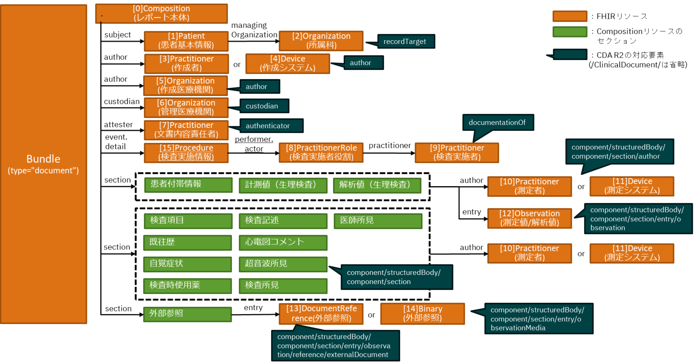
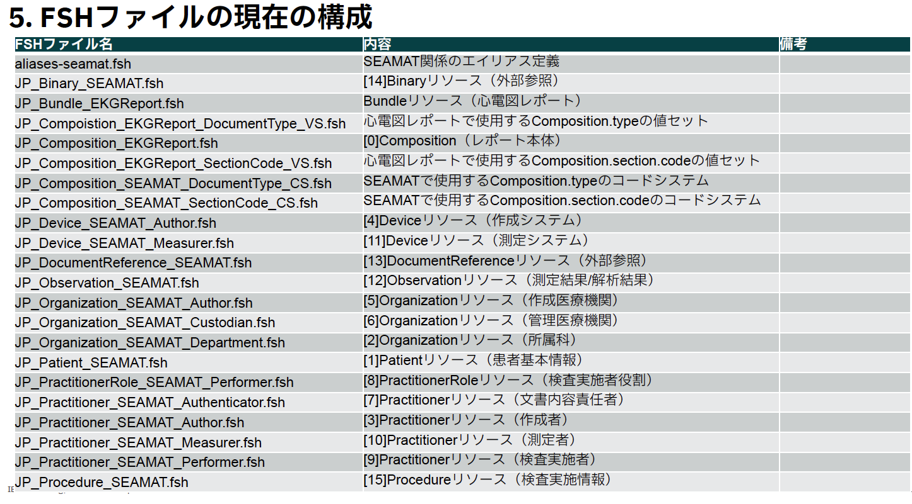

### SEAMATフォーマットをFHIRに変換するためのFHIR実装ガイド
 <<注意：このIGは開発中のバージョンです。>>
  <<本実装ガイドは、内閣府SIP第3期「統合型ヘルスケアシステムの構築」サブテーマD1の研究開発のひとつとして作成されています。>>
 

#### このImplementationガイド(IG)の目的：

本実装ガイドは、SEAMATに準拠したデータフォーマットとフォルダ構成でSS-MIX2拡張ストレージに出力された心電図レポートのCDA文書を、FHIRドキュメントに変換する際の各種制約を記述する。

本実装ガイドは、FHIR R4.0.1に従い、JP-Core V1.1.xからの派生プロファイルの実装ガイドとして作成されている。従って、本IGに記述されていないことについては、JP-Core V1.1.xを参照していただきたい。

#### 想定する運用形態

## 心電図レポート用FHIRドキュメントの概要

 

### 心電図レポート用FHIRドキュメントのトピック

#### 各リソースのプロファイルのURLの命名規則を下記とする
  
    http://jpfhir.jp/fhir/SEAMAT/StructureDefinition/JP_<リソース名>_SEAMAT_<用途>（SEAMAT共通）
  
    http://jpfhir.jp/fhir/SEAMAT/StructureDefinition/JP_<リソース名>_EKGReport（心電図固有）

#### Bundle.identifierにSS-MIX2拡張ストレージのコンテンツフォルダ名を持たせる

SS-MIX2では、拡張ストレージのコンテンツフォルダ名は、以下のような書式で記載することが求められている。

  「<患者ID>_<診療日>_<データ種別>_<特定キー>_<発生日時>_<診療科コード>_<コンディションフラグ>」

SEAMATでは、これらの要素に、以下のような項目を組み合わせて指定することが決められている。

 - <患者ID> : 心電図レポートの対象患者の該当医療機関におけるID
 - <診療日> : 心電図レポートの対象となった心電図検査の検査日（<検査日>）
 - <データ種別> : 心電図レポートのデータ種別情報を「<データ種別コード><レポート/データフラグ>」形式で指定する。（例：LJCS-100D）
   - <データ種別コード> : 診療情報を大きく分類するためのコード
   - <レポート/データフラグ> : 検査レポート、検査データを区別するためのフラグ
 - <特定キー> : 心電図レポートの対象検査の各種ID情報を「<ファイル作成日時>.<データ管理番号>.<オーダ番号>.<部門管理番号>」形式で指定する。
   - <ファイル作成日時> : 検査レポートの場合は検査レポート作成日時。検査データの場合はモダリティでの測定日時相当の日時
   - <データ管理番号> : データやレポートを識別する同一部門管理番号内でユニークな値
   - <オーダ番号> : 電子カルテが発番する、施設内でユニークなオーダ単位の値
   - <部門管理番号> : 検査部門が発番する検査毎にユニークな値

本実装ガイドでは、上記の<検査日><データ種別コード><レポート/データフラグ><ファイル作成日時><データ管理番号><オーダ番号><部門管理番号>の計7項目を、SEAMATのキー情報と呼ぶ。

#### SS-MIX2拡張ストレージのコンテンツフォルダ名からSEAMATのキー情報を抽出して、Procedureリソースに個別にマッピングする

本実装ガイドでは、SEAMATのキー情報のうち、<検査日><データ種別コード><レポート/データフラグ><データ管理番号><オーダ番号><部門管理番号>の6項目をProcedureリソースを使用して個別にマッピングする。マッピング先の要素は以下の通り。
  - <検査日> : performedDateTime要素
  - <データ種別コード><レポート/データフラグ> : category要素
  - <データ管理番号> : identifier要素
  - <オーダ番号> : identifier要素
  - <部門管理番号> : identifier要素

#### Observationリソースは、血液型/測定値/解析値用のプロファイルを用意する

#### 外部参照については、FHIRサーバーへの登録のため、外部ファイルの内容をDocumentReferenceないしBinaryリソース内に内包する

## FSHファイルの構成

 


